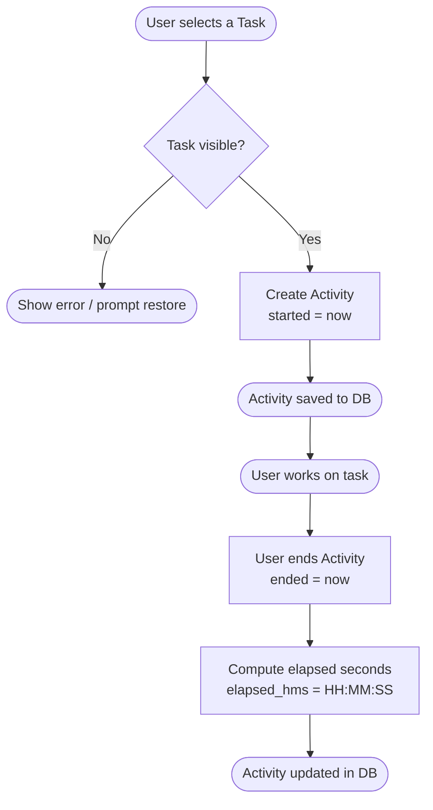
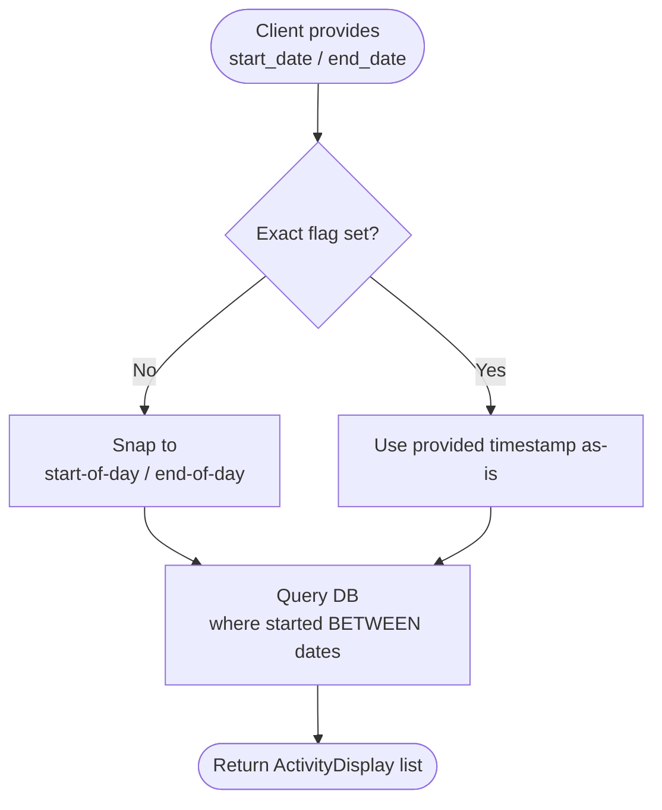

# PyTaskTracker - Business Requirements

## 🎯 Business Summary

PyTaskTracker is a personal and team productivity tool that enables users to organise work into **Task Groups** and **Tasks**, then track time spent on individual work sessions (**Activities**) with automatic elapsed-time calculation. It is delivered as a self-contained Python application with three runtime modes — a browser-based GUI, a REST API, and a CLI — backed by an embedded DuckDB database that requires no separate database server.

---

## 👥 Targeted Personas

| Persona | Description |
|---|---|
| **Individual Contributor** | A developer, analyst, or knowledge worker who needs to log time against tasks and review their own productivity throughout the day. |
| **Team Lead / Manager** | A manager who uses the REST API to query aggregated activity data and generate reports against project tasks. |
| **DevOps / Integrator** | An engineer who embeds PyTaskTracker as a headless REST service inside a larger automation pipeline or CI workflow. |
| **Power User / Scripter** | A user who drives the application programmatically via the CLI or REST API to automate time-entry workflows. |

---

## 📋 Functional Requirements

### Task Group Management

| ID | Requirement |
|---|---|
| **[FR-001]** | The system **shall** allow users to create a Task Group with a unique name and an optional description. |
| **[FR-002]** | The system **shall** allow users to update the name and description of an existing Task Group. |
| **[FR-003]** | The system **shall** allow users to soft-delete a Task Group, hiding it from default views while retaining its data. |
| **[FR-004]** | The system **shall** allow users to restore (un-delete) a previously soft-deleted Task Group. |
| **[FR-005]** | The system **shall** provide a filtered view returning only visible (non-deleted) Task Groups, and a separate view returning all Task Groups regardless of visibility state. |

### Task Management

| ID | Requirement |
|---|---|
| **[FR-006]** | The system **shall** allow users to create a Task with a unique name, an optional description, and an associated Task Group. |
| **[FR-007]** | The system **shall** allow users to update the name, description, and visibility of an existing Task. |
| **[FR-008]** | The system **shall** allow users to soft-delete a Task, hiding it from default views while retaining its data. |
| **[FR-009]** | The system **shall** allow users to restore (un-delete) a previously soft-deleted Task. |
| **[FR-010]** | The system **shall** provide a filtered view returning only visible (non-deleted) Tasks joined with their parent Task Group, and a separate view returning all Tasks regardless of visibility state. |

### Activity (Time Tracking) Management

| ID | Requirement |
|---|---|
| **[FR-011]** | The system **shall** allow users to start a new Activity against a Task, recording the start timestamp automatically. |
| **[FR-012]** | The system **shall** allow users to end a running Activity, recording the end timestamp and computing elapsed time in whole seconds. |
| **[FR-013]** | The system **shall** expose the elapsed time of a completed Activity in `HH:MM:SS` format as a computed (non-persisted) field. |
| **[FR-014]** | The system **shall** allow users to update any mutable field on an existing Activity (description, start time, end time). |
| **[FR-015]** | The system **shall** retrieve all Activities joined with their parent Task and Task Group. |
| **[FR-016]** | The system **shall** support date-range filtering of Activities by start date, defaulting to the current calendar day when no dates are supplied. |
| **[FR-017]** | The system **shall** support exact-timestamp filtering as well as day-boundary snapping (start-of-day / end-of-day) for Activity queries. |

### Multi-Mode Runtime

| ID | Requirement |
|---|---|
| **[FR-018]** | The system **shall** expose all Task Group, Task, and Activity operations through a browser-based graphical user interface (GUI mode). |
| **[FR-019]** | The system **shall** expose all Task Group, Task, and Activity operations through a RESTful HTTP API (REST mode). |
| **[FR-020]** | The system **shall** be launchable from the command line with configurable port, database URL, database recreation flag, and runtime mode (CLI mode). |

### Database & Persistence

| ID | Requirement |
|---|---|
| **[FR-021]** | The system **shall** support both in-memory (`:memory:`) and file-backed DuckDB databases, configurable at startup. |
| **[FR-022]** | The system **shall** support a `--recreate-db` flag that drops and recreates all schema tables on startup (intended for testing and development). |
| **[FR-023]** | All entities **shall** automatically record `created_at` and `updated_at` audit timestamps. |

### Error Handling

| ID | Requirement |
|---|---|
| **[FR-024]** | The REST API **shall** return a structured JSON error response for duplicate-entry / constraint violations (HTTP 400). |
| **[FR-025]** | The REST API **shall** return a structured JSON error response for application-level errors and unexpected exceptions (HTTP 400). |
| **[FR-026]** | The REST API **shall** return HTTP 404 with a descriptive message when an update is attempted on a non-existent Task. |

### Logging

| ID | Requirement |
|---|---|
| **[FR-027]** | The system **shall** write structured JSON logs to a rotating log file (`logs/pytasktracker.log`) with weekly rotation and 4-week retention. |
| **[FR-028]** | The system **shall** echo INFO-level logs to standard output for real-time monitoring. |

---

## 🔄 Key Business Flows

### Flow 1 – Start Tracking Work on a Task

### Flow 2 – Task Group Lifecycle

### Flow 3 – Activity Date-Range Query

