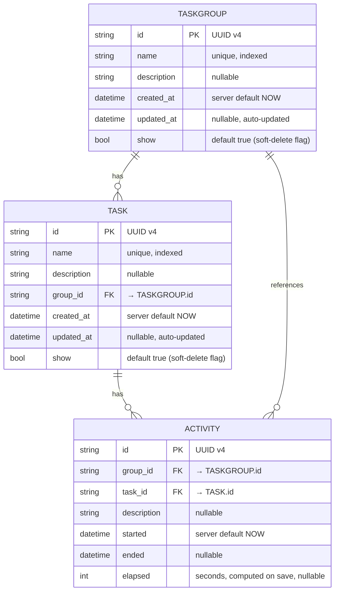
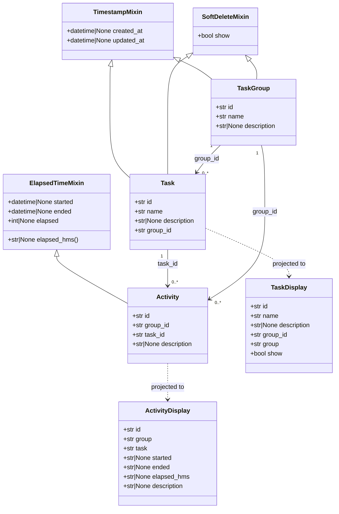

# PyTaskTracker - Data Models

## 🎯 Summary

PyTaskTracker uses three database entities — **TaskGroup**, **Task**, and **Activity** — together with three reusable mixins that add audit timestamps, soft-delete capability, and elapsed-time tracking.

---

## 🗂️ Entity Relationship Diagram

---

## 🏛️ Class Diagram

---

## 📐 Mixin Reference

| Mixin | Fields Added | Purpose |
|---|---|---|
| `TimestampMixin` | `created_at`, `updated_at` | Audit trail for all entities |
| `SoftDeleteMixin` | `show` (bool, default `True`) | Non-destructive hide/restore pattern |
| `ElapsedTimeMixin` | `started`, `ended`, `elapsed` (int seconds), `elapsed_hms` (computed `HH:MM:SS`) | Time-tracking lifecycle for Activities |

---

## 📦 Display / Projection Models

These are **read-only response shapes** used by the REST API — they are **not** persisted.

### `TaskDisplay`
Flattens `Task` + `TaskGroup` into a single response object, adding the `group` name as a string.

### `ActivityDisplay`
Flattens `Activity` + `Task` + `TaskGroup` into a single response object, serialising datetime fields as ISO-8601 strings and exposing `elapsed_hms`.

---

## 🔑 Key Design Decisions

| Decision | Rationale |
|---|---|
| UUID v4 primary keys | Avoids auto-increment conflicts; supports distributed or merged datasets |
| `show` soft-delete flag | Preserves historical integrity; deleted items can be restored without data loss |
| `elapsed` stored as integer seconds | Enables arithmetic queries (sum, average) directly in SQL without datetime subtraction |
| `elapsed_hms` as a computed Pydantic field | Human-readable format kept out of the DB to avoid staleness |
| `group_id` denormalised onto `Activity` | Allows single-join group-level activity queries without chaining through `Task` |
| DuckDB embedded database | Zero infrastructure dependency; file or in-memory modes support both production and testing |
