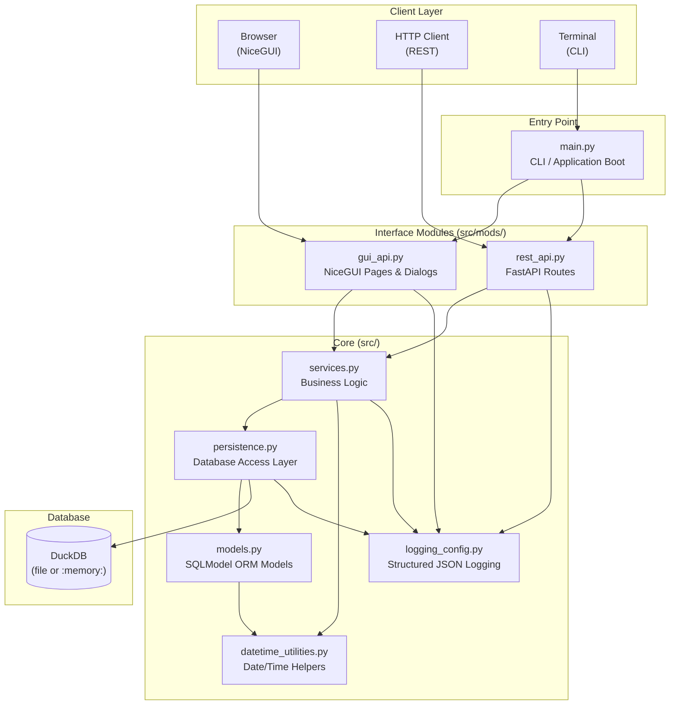
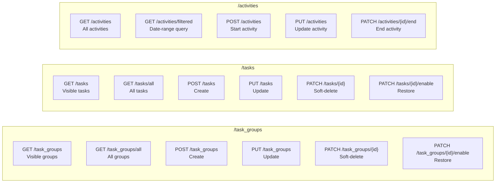
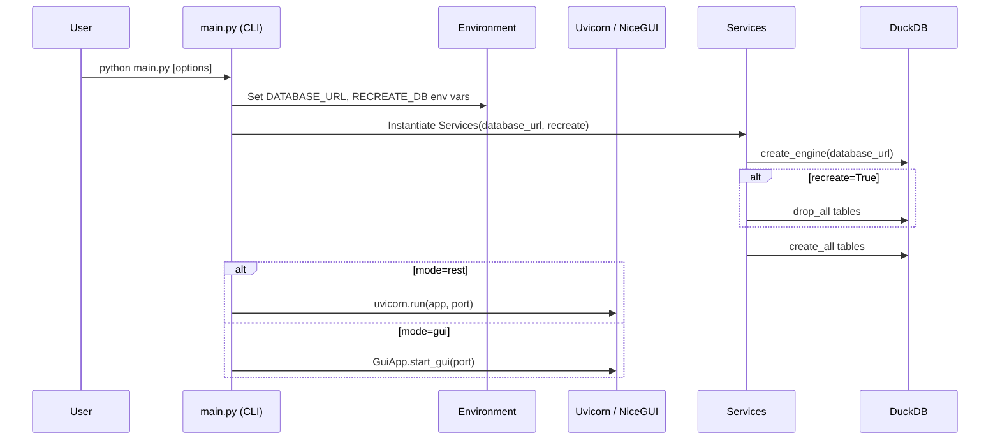

# PyTaskTracker - Technical Architecture

## 🎯 Summary

PyTaskTracker is a layered Python application comprising an **Entry Point / CLI**, a **Service Layer**, a **Persistence Layer**, and two optional interface modules — a **REST API** (FastAPI) and a **GUI** (NiceGUI). All state is stored in an embedded DuckDB database accessed through SQLModel / SQLAlchemy.

---

## 🏗️ Component Diagram

---

## 🔌 REST API Endpoint Map

---

## ⚙️ Application Startup Flow

---

## 🔒 Error Handling Strategy

| Scenario | Handler | HTTP Status |
|---|---|---|
| Duplicate / constraint violation | `@app.exception_handler(IntegrityError)` | 400 |
| Application-level error | `@app.exception_handler(BaseAppException)` | Configurable (default 400) |
| Task not found on update | Inline raise `BaseAppException` | 404 |
| All other exceptions | `@app.exception_handler(Exception)` | 400 |

---

## 🛠️ Technology Stack

| Concern | Technology |
|---|---|
| Language | Python 3.12+ |
| ORM / Models | SQLModel + Pydantic v2 |
| Database | DuckDB (embedded) |
| REST Framework | FastAPI + Uvicorn |
| GUI Framework | NiceGUI |
| CLI Framework | Click + dataclass-click |
| Type Checking | ty (Astral) |
| Logging | Loguru (JSON, rotating) |
| Package Manager | uv |
| Testing | pytest |
